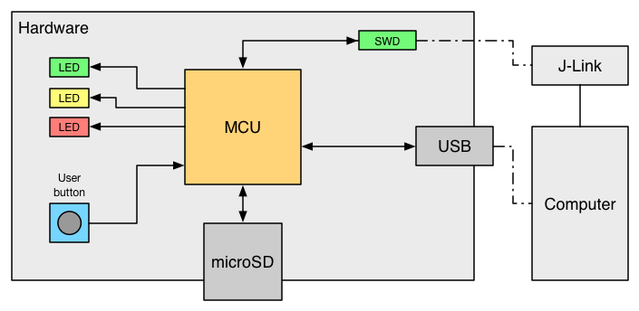

# STM32 Bootloader demonstration on STM32L496VG
This example utilizes the STM32L496VG microcontroller and it demonstrates how to perform in-application-programming of a firmware located on external SD card with FAT32 file system.

Please refer to the main [README](../../README.md) for the complete description about the functionality and operation of the bootloader library.

## Table of Contents
- [Description](#description)
- [Operation](#operation)
- [References](#references)

## Description
This demo is implemented on a custom hardware (see Figure 1) equipped with a STM32L496VG microcontroller [[1]](#references). The microSD card is connected to the MCU over SDIO interface. The implementation uses the official HAL library of ST [[2]](#references) and is compiled with IAR EWARM. Programming and debugging are performed over SWD with a SEGGER J-Link debug probe.

*Figure 1: System overview*

The microcontroller flash is organized as follows: by default, the first 32kBytes (16 pages) of the flash is reserved for the bootloader and the rest of the flash is the application space.

*Figure 2: Flash organization*

## Operation
After power-up, the bootloader starts. All three LEDs are flashed for a second, then the bootloader checks for user-interaction:

- If the button is not pressed, then the bootloader tries to launch the application: First it checks the application space. If there is a firmware located in the application space, the bootloader calculates the checksum over the application space and compares with the application checksum (if the checksum feature is enabled). Finally, the bootloader prepares for the jump by resetting the peripherals, disabling the SysTick, setting the vector table and stack pointer, then the bootloader performs a jump to the application.

- If the button is pressed and released within 4 seconds: the bootloader tries to update the application firmware by performing the following sequence:

    1. Checks for write protection. If the application space is write-protected, then the red LED is switched on and the yellow LED is flashed for five seconds. If the button is pressed within this interval, the bootloader disables the write protection by re-programming the flash option bytes and performs a system reset (required after flash option bytes programming). Please note that after disabling the write protection, the user has to invoke the application update procedure again by pressing the button in order to continue the firmware update.
    2. Initializes SD card, looks for application binary and opens the file.
    3. Checks the file size whether it fits the application space in the microcontroller flash.
    4. Initializes microcontroller flash.
    5. Erases the application space. During erase, the yellow LED is on. If the user presses the button and keeps it pressed until the end of the flash erase procedure, the bootloader then interrupts the firmware update and does not perform flash programming after the erase operation. This feature is useful if the user only wants to erase the application space.
    6. Performs flash programming. During flashing, the green LED is blinking.
    7. Verifies flash programming by re-opening the firmware file located on the SD card and comparing the content of the file with the flash content.
    8. Enables write protection of application space if this feature is enabled in the configuration.
    9. After successful in-application-programming, the bootloader launches the application.

- If the button is pressed for more than 4 seconds: the bootloader launches ST's built-in bootloader located in the internal boot ROM (system memory) of the chip. For more information, please refer to [[3]](#references). With this method, the bootloader can be updated or even a full chip re-programming can be performed easily, for instance by connecting the hardware to the computer via USB and using DFU mode [[4, 5]](#references).

- If the button is kept pressed for more than 9 seconds: the bootloader tries to launch the application located in the flash. This scenario is fully equivalent to the case when the user does not press the button after power-up (see above).

*Figure 3: Bootloader sequence*

## References
[1] STM32L496VG, http://www.st.com/en/microcontrollers/stm32l496vg.html

[2] UM1884, “Description of STM32L4 HAL and Low Layer drivers”, http://www.st.com/resource/en/user_manual/dm00173145.pdf

[3] AN2606, "STM32 microcontroller system memory boot mode", http://www.st.com/resource/en/application_note/cd00167594.pdf

[4] AN3156, "USB DFU protocol used in the STM32 bootloader", http://www.st.com/resource/en/application_note/cd00264379.pdf

[5] UM0412, "Getting started with DfuSe USB device firmware upgrade", http://www.st.com/resource/en/user_manual/cd00155676.pdf
